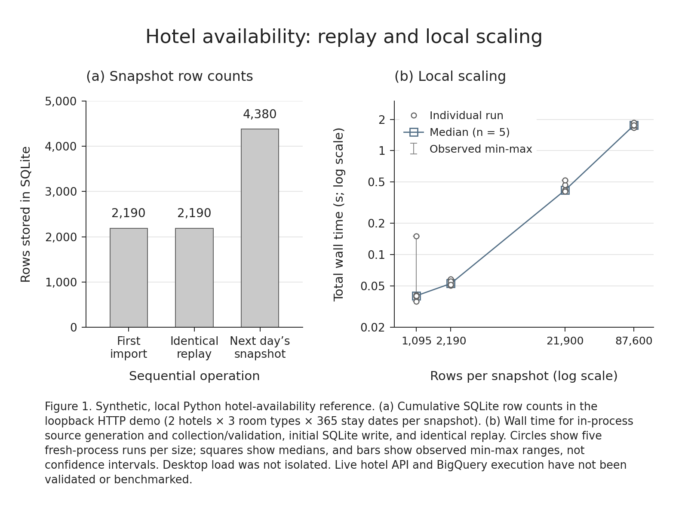

# Hotel availability pipeline

A Python batch importer for daily hotel room availability. It reads a paginated REST API, checks every expected room type and date, and stores daily snapshots in SQLite or BigQuery.

This reference uses synthetic data. The local HTTP-to-SQLite path is exercised end to end; vendor-specific mapping and live BigQuery execution remain to be validated. It does not include reservations, cancellations or dictionary synchronization.



The figure reports local measurements collected on 28 September 2026. [Measurements and scope](docs/benchmark-scaling.json) include all 20 timing runs and the measured source revision; they are not a vendor or cloud benchmark.

## Quick start

Python 3.12 or newer is required. CI runs on Windows and Ubuntu with Python 3.12 and 3.13; [results are available on GitHub](https://github.com/PellaML/hotel-etl-reference/actions/workflows/verify.yml).

Windows PowerShell:

```powershell
python -m venv .venv
.\.venv\Scripts\python.exe -m pip install .
.\.venv\Scripts\python.exe -m hotel_etl demo --output-dir output/demo
```

Linux or macOS:

```sh
python3.12 -m venv .venv
.venv/bin/python -m pip install .
.venv/bin/python -m hotel_etl demo --output-dir output/demo
```

The demo needs no API credentials or Google Cloud account. It starts a loopback-only fixture server, imports two synthetic hotels with three room types each over 365 stay dates, writes the same snapshot again, and adds the next day's snapshot.

| Check | Rows in SQLite |
| --- | ---: |
| First snapshot | 2,190 |
| Identical replay | 2,190 |
| Second snapshot day | 4,380 |

The output directory contains:

- `availability.sqlite`: the retained snapshot rows.
- `snapshot.ndjson`: a line-delimited JSON export.
- `summary.json`: counts, dates and the local output path.

Existing demo output is never overwritten. Use a new directory, such as `output/demo-2`, for another run. Review local paths before sharing the summary file.

The core has no runtime dependencies outside the standard library. A source installation uses pip's build isolation to obtain its setuptools build backend.

## Connect a source API

Check the vendor API against [the input contract](docs/API_CONTRACT.md) and adjust the adapter where they differ. Replace the identifiers in [examples/hotels.json](examples/hotels.json) with the expected hotel and room-type identifiers. Missing inventory is not silently treated as zero.

Set `HOTEL_API_BASE_URL` and `HOTEL_API_TOKEN` in the process environment. Use HTTPS for a remote source. Do not put tokens in command arguments or source control; `.env` files are not loaded automatically.

```powershell
$env:HOTEL_API_BASE_URL = 'https://api.example.invalid/v1'
# Supply HOTEL_API_TOKEN separately through the shell or a secret manager.
New-Item -ItemType Directory -Path output -Force | Out-Null
.\.venv\Scripts\python.exe -m hotel_etl sync --config examples/hotels.json --days 365 --sqlite output/local.sqlite
```

Use `python -m hotel_etl sync --help` for the date, destination and location options. The default observation time is now in UTC, and the default first stay date is that observation's UTC date. A 365-day horizon is not always the same as a calendar year.

Commands emit a JSON summary to standard output on success. Operational errors go to standard error, without the bearer token, response body or request URL. Exit codes are 0 for success, 1 for an operational error, 2 for command-line parsing errors and 130 for a keyboard interruption. An interruption does not establish whether a remote job completed; check the destination before retrying.

## BigQuery

Install the optional Google SDK with `python -m pip install '.[bigquery]'`. Use Application Default Credentials, and prepare an existing table using [the example schema](examples/bigquery-schema.sql). Keep the table and jobs in the intended location.

```sh
python -m hotel_etl sync --config examples/hotels.json --days 365 \
  --bigquery YOUR_PROJECT.YOUR_DATASET.availability_snapshot --location EU
```

BigQuery writes require a single writer across all executions. `parallelism=1` on one Cloud Run execution does not prevent another execution from overlapping it. Review [deployment, IAM and cost controls](docs/DEPLOYMENT.md) before running against a cloud project.

The adapter is tested with fake clients and the real SDK over fake HTTP. Those tests do not execute GoogleSQL or establish production readiness.

## Data guarantees

- Every configured hotel, room type and stay date must be present before any sink write.
- Identical source duplicates are collapsed; conflicting duplicates stop collection.
- A newer same-day observation replaces an older value. An older observation cannot overwrite a newer one.
- Previous snapshot days are retained. Intraday history is not retained separately.
- SQLite writes are transactional. The BigQuery adapter has its own staging and completion rules.
- Response sizes, pages, record counts and retries are bounded. The HTTP timeout is per I/O operation; configure an overall job deadline separately.

## Development and documentation

```sh
uv sync --locked --all-extras --python 3.12
uv run --locked --all-extras ruff check .
uv run --locked --all-extras ruff format --check .
uv run --locked --all-extras mypy
uv run --locked --all-extras pytest --cov=hotel_etl --cov-branch --cov-report=term-missing
```

- [Architecture](docs/ARCHITECTURE.md): module responsibilities and data flow.
- [Input API contract](docs/API_CONTRACT.md): authentication, pagination and data rules.
- [OpenAPI and read-only Swagger UI](docs/api/README.md): synthetic fixture behavior, examples and local launch instructions.
- [Deployment](docs/DEPLOYMENT.md): BigQuery, Cloud Run and operational limits.
- [Verification](docs/VERIFICATION.md): test scope and commands.
- [Local benchmark sample](docs/benchmark-current.json): synthetic validation and SQLite writes, with memory tracing enabled. It is not API or cloud throughput.

Run `uv run --locked --all-extras python scripts/benchmark.py --output output/benchmark.json` to reproduce the benchmark workload. Desktop timings vary; compare like-for-like runs and do not treat profiler overhead as application throughput.

MIT license. The example contains no real hotel inventory, guest records or credentials.
